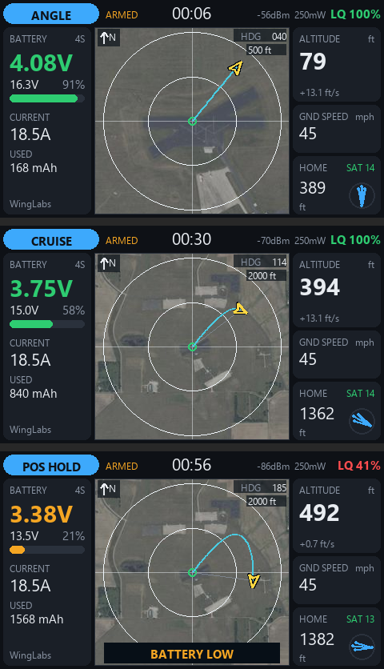

# WL Maps widget — INAV telemetry + full-height map for EdgeTX 2.11 (ELRS/CRSF)

One of three WingLabs EdgeTX telemetry widgets:

| Widget | Center of the screen | Project folder (in `widgets_edgetx\480x272px`) | SD folder |
|---|---|---|---|
| WL Attitude Ind | attitude indicator | `WLAttitudeInd` | `/WIDGETS/WLAttitudeInd/` |
| WL Avionics | attitude indicator on top, map below | `WLAvionics` | `/WIDGETS/WLAvionics/` |
| **WL Maps** | **full-height map** | `WLMaps` | `/WIDGETS/WLMaps/` |

The map: home at the center, north up, aircraft arrow rotated by heading, flight trail, range
rings with automatic zoom (100 ft → 20 mi or 50 m → 50 km), line to home, heading (HDG) and the
alert banner at its bottom edge. Optional satellite photo underneath. Battery, link, altitude,
speed and home cards are the same as in the other two widgets. Target: TX16S MK2 (480×272). The TX16S MK3 (800×480, EdgeTX 2.12+) build of the same widgets is in `widgets_edgetx\800x480px`.

**Recommended: EdgeTX 2.11.2 or later** (2.11.0/2.11.1 only redraw an LVGL line when its first
point changes; the widget works around it and the simulator checks it).



## Installation

1. Copy `WIDGETS/WLMaps/` to the radio SD card: `/WIDGETS/WLMaps/`
   (EdgeTX silently skips widget folders over 13 characters).
2. On the radio: *Model → Screens* → **Full screen** layout (Top bar, Sliders, Trims and Flight mode
   off) → widget **WL Maps**.
3. Options: Theme, Units, Cells, CellWarn/CellCrit, AltWarn, Sounds/Haptic, MapPhoto
   (same meaning as in WL Avionics).

## Satellite photo (optional)

Tiles are made with the generator in the WL Avionics project and shared by both map widgets:

```
cd ..\WLAvionics
python tools/maptiles/make_field.py --name ama --lat 40.1666 --lon -85.3195 --radius-mi 5 --radio all
```

This widget uses the `mk2full` tile set (ring 111 px). Fine steps cover: 100 ft 0.25 mi,
200 ft 0.5 mi, 500 ft 1 mi; 1000 ft and up: the whole radius. At 100 ft the screen is 0.27 m/px,
finer than the 0.6 m/px imagery, so that step looks a bit soft.
Copy `..\WLAvionics\tools\maptiles\out\WLMAP` to the SD card root → `/WLMAP/`.

## Layout

```
WIDGETS/WLMaps/
  main.lua     widget life cycle, options, field list (/WLMAP/fields.lua, read once)
  telem.lua    CRSF sensor discovery, 10 Hz polling, home/distance, cached strings
  map.lua      vector map + photo tiles (same module as WL Avionics)
  alerts.lua   priority banner + tones/voice/haptic (max 3 per episode, 3 short pulses)
  ui.lua       LVGL build (full screen and compact layouts)
  themes.lua   palettes
tools/sim/     desktop simulator (reads photo tiles from the WLAvionics project)
```

## Simulator

```
pip install -r tools/sim/requirements.txt
python tools/sim/run_sim.py
```

## Changes

- **0.1.0** (2026-10-07): first version, from WL Avionics 0.2.1 without the attitude indicator.

## To verify on the radio

- [ ] Photo tiles show up, no stutter when crossing tiles, position over the photo matches reality.
- [ ] Real font sizes, haptic pulse strength, `CHOICE` options on your EdgeTX 2.11.x.
