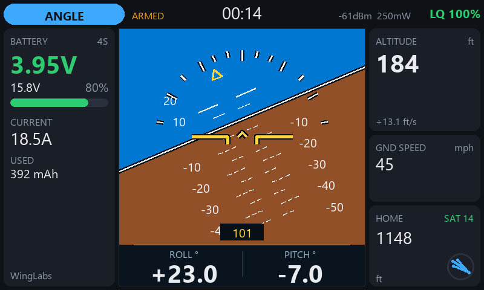

# WL Attitude Ind widget — INAV telemetry for EdgeTX 2.12 (ELRS/CRSF) — TX16S MK3 (800×480)

One of three WingLabs EdgeTX telemetry widgets:

| Widget | Center of the screen | Project folder (in `widgets_edgetx\800x480px`) | SD folder |
|---|---|---|---|
| **WL Attitude Ind** | **attitude indicator** | `WLAttitudeInd` | `/WIDGETS/WLAttitudeInd/` |
| WL Avionics | attitude indicator on top, map below | `WLAvionics` | `/WIDGETS/WLAvionics/` |
| WL Maps | full-height map | `WLMaps` | `/WIDGETS/WLMaps/` |

A color-screen telemetry widget for EdgeTX with a modern LVGL UI and themes, built to stay
responsive for the whole flight. The attitude indicator has the same look as the WingLabs
attitude indicator firmware (WingUI).

**Requires EdgeTX 2.12 or later** (the first release with TX16S MK3 support). The TX16S MK2
(480×272, EdgeTX 2.11+) build of the same widgets is in `widgets_edgetx\480x272px`.



## Installation

1. Copy `WIDGETS/WLAttitudeInd/` to the radio SD card: `/WIDGETS/WLAttitudeInd/`.
   Do not rename it to something longer: EdgeTX silently skips widget folders over 13 characters.
2. On the radio: *Model → Screens* → add a screen with the **Full screen** layout (turn off Top bar,
   Sliders, Trims and Flight mode, otherwise the EdgeTX menu button covers the top-left corner) and
   pick the **WL Attitude Ind** widget. Small zones get a compact layout.
3. Widget options:

| Option | Values | Default |
|---|---|---|
| Theme | Dark, Light, Navy, Sunlight, Night | Dark |
| Units | Imperial, Metric | Imperial |
| Cells | 0 = auto, 1–14 | 0 |
| CellWarn / CellCrit | centivolts per cell (350 = 3.50 V) | 350 / 330 |
| AltWarn | alert altitude in ft/m, 0 = off | 400 |
| Sounds / Haptic | on/off | on |

Run *Discover new sensors* on the telemetry page with the model connected. Missing sensors are
looked up again every 2 s.

## Design principles

Built to stay responsive for a whole flight:

- Plain `.lua` only; EdgeTX compiles and caches it itself.
- Every module is loaded once in `create()`; nothing is read from the SD card per frame.
- No manual garbage collection; almost no garbage per frame (~0.8 KB).
- Telemetry is polled at a fixed rate and display strings are formatted only when a value changes.
- Colors come from semantic theme tokens (`lcd.RGB`), so themes are easy to add.
- No globals, no bitmaps, and model timers are never touched.
- When the link is lost, the last values stay on screen dimmed (last position helps find the model).

The horizon is drawn with LVGL lines only: EdgeTX LVGL triangles malloc/free a mask every time
they change, which fragments RAM at 20 Hz.

## Layout

```
WIDGETS/WLAttitudeInd/
  main.lua     widget life cycle, options
  telem.lua    CRSF sensor discovery, 10 Hz polling, home/distance, cached strings
  horizon.lua  attitude indicator in the WingLabs firmware style (WingUI): 5° pitch ladder,
               bank ticks, gold pointer (lines only, preallocated tables)
  alerts.lua   priority banner + tones/voice/haptic with cooldowns; a repeating alert sounds at
               most 3 times per episode, haptic = 3 short pulses (~80 ms)
  ui.lua       LVGL build (full screen and compact layouts)
  themes.lua   palettes (add themes here)
tools/sim/     desktop simulator (strict EdgeTX/LVGL mock on Lua 5.3)
```

## Simulator

```
pip install -r tools/sim/requirements.txt
python tools/sim/run_sim.py
```

Runs a synthetic flight (no link → WAIT GPS → armed → RTH → link lost → failsafe → battery
critical). Checks types and coordinates like the firmware, instructions per call (EdgeTX limit
20,000; for callbacks only the widget's own instructions count) and bytes allocated per frame.
Writes screenshots to `tools/sim/out/` (including `att_*.png` poses) and runs the "model switched
off" test: 70 s without telemetry → exactly 3 alerts and 9 haptic pulses.

## Changes

- **0.2.0** (2026-10-07): "telemetry lost" (and failsafe, battery, altitude, weak link) alerts at most
  3 times, re-armed when the condition clears; haptic as short pulses (arm 2, disarm 1, alerts 3);
  horizon identical to the WingLabs Attitude Indicator with a ROLL/PITCH strip; heading in a box
  at the bottom.
- **0.1.0**: first version. Tested on the radio: works well overall.

## To verify on the radio (not possible in the simulator)

- [ ] **Pitch/roll sign**: model in hand, nose up = horizon moves down; right wing down = horizon
      rotates left. If reversed, change `PITCH_SIGN` / `ROLL_SIGN` in `telem.lua`.
- [ ] Ground band performance, and the horizon box must not scroll when touched in full screen.
- [ ] Real font sizes (the simulator approximates with Segoe UI) and the ° sign in ROLL/PITCH.
- [ ] Haptic pulse strength (`PULSE`/`GAP` in `alerts.lua`; also Radio Setup → Haptic length/strength).
- [ ] `CHOICE` options (Theme/Units) on your exact EdgeTX 2.12.x.
- [ ] Altitude: if INAV sends baro and GPS, check which one the `Alt` sensor uses.

## Ideas

- Custom voice files (WAV) for flight modes; today tones plus `playNumber` with the radio voice.
- Flight statistics page (maximums) and touch in full screen to switch pages.
- Log playback (non-blocking: incremental read per frame).
