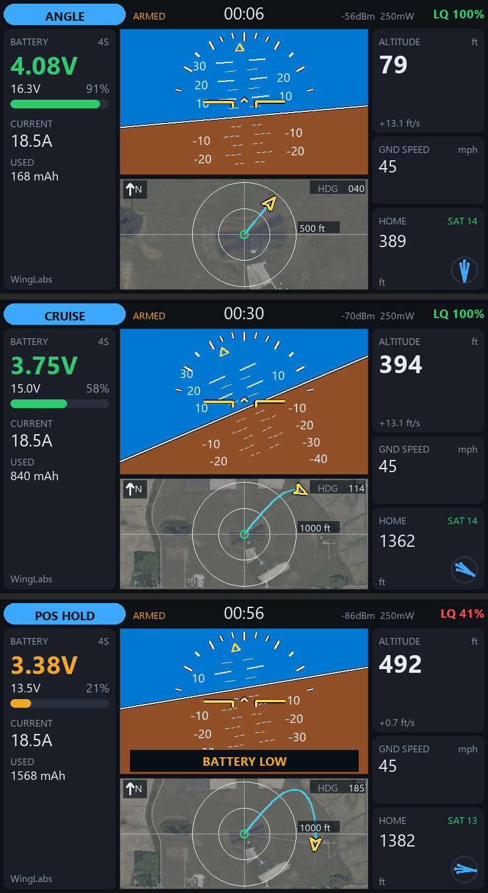

# WL Avionics widget — INAV telemetry + map for EdgeTX 2.12 (ELRS/CRSF) — TX16S MK3 (800×480)

One of three WingLabs EdgeTX telemetry widgets:

| Widget | Center of the screen | Project folder (in `widgets_edgetx\800x480px`) | SD folder |
|---|---|---|---|
| WL Attitude Ind | attitude indicator | `WLAttitudeInd` | `/WIDGETS/WLAttitudeInd/` |
| **WL Avionics** | **attitude indicator on top, map below** | `WLAvionics` | `/WIDGETS/WLAvionics/` |
| WL Maps | full-height map | `WLMaps` | `/WIDGETS/WLMaps/` |

The map: home at the center, north up, aircraft arrow rotated by heading, flight trail, range
rings with automatic zoom (100 ft → 20 mi or 50 m → 50 km), line to home and heading (HDG).
Optional satellite photo underneath (see below). Target: TX16S MK3 (800×480).

**Requires EdgeTX 2.12 or later** (the first release with TX16S MK3 support). The TX16S MK2 (480×272, EdgeTX 2.11+) build of the same widgets is in `widgets_edgetx\480x272px`.

A color-screen telemetry widget for EdgeTX with a modern LVGL UI and themes, built to stay
responsive for the whole flight.



## Installation

1. Copy `WIDGETS/WLAvionics/` to the radio SD card: `/WIDGETS/WLAvionics/`.
   Do not rename it to something longer: EdgeTX silently skips widget folders over 13 characters.
2. On the radio: *Model → Screens* → add a screen with the **Full screen** layout (turn off Top bar,
   Sliders, Trims and Flight mode) and pick the **WL Avionics** widget. Small zones get a compact layout.
3. Widget options:

| Option | Values | Default |
|---|---|---|
| Theme | Dark, Light, Navy, Sunlight, Night | Dark |
| Units | Imperial, Metric | Imperial |
| Cells | 0 = auto, 1–14 | 0 |
| CellWarn / CellCrit | centivolts per cell (350 = 3.50 V) | 350 / 330 |
| AltWarn | alert altitude in ft/m, 0 = off | 400 |
| Sounds / Haptic | on/off | on |
| MapPhoto | satellite photo under the map | on |

Run *Discover new sensors* on the telemetry page with the model connected. Missing sensors are
looked up again every 2 s.

## Design principles

Built to stay responsive for a whole flight:

- Plain `.lua` only; EdgeTX compiles and caches it itself.
- Every module is loaded once in `create()`; nothing is read from the SD card per frame.
- No manual garbage collection; almost no garbage per frame (~0.8 KB).
- Telemetry is polled at a fixed rate and display strings are formatted only when a value changes.
- Colors come from semantic theme tokens (`lcd.RGB`), so themes are easy to add.
- No globals, no bitmaps, and model timers are never touched.
- When the link is lost, the last values stay on screen dimmed (last position helps find the model).

The horizon and map are drawn with LVGL lines only: EdgeTX LVGL triangles malloc/free a mask
every time they change, which fragments RAM at 20 Hz.

## Satellite photo of the flying field (optional)

USGS NAIP imagery (US public domain, ~0.6 m/px, USA only).

1. Make the tiles on the PC (Python with Pillow):

   ```
   python tools/maptiles/make_field.py --name ama --lat 40.1666 --lon -85.3195 --radius-mi 5
   ```

   For every map zoom step (100 ft … 5 mi) it renders 512×512 JPG tiles at **exactly the screen
   pixel size of that step**, so the radio never scales images. Each map size has its own tile set
   (`--radio mk3` = this widget, ring 85 px; `mk3full` = WL Maps, ring 207 px; default `all` =
   both). On 800×480 the maps are bigger, so tiles are 512 px: at most 2×2 visible. Fine steps cover a smaller radius (this widget: 100 ft 0.5 mi, 200 ft 1 mi, 500 ft 2 mi;
   1000 ft and up: the whole radius, max 16×16 tiles per step). It can be stopped and restarted: it resumes. Several fields:
   run it once per field.
2. Copy `tools/maptiles/out/WLMAP` to the **root** of the SD card → `/WLMAP/` (shared by both map widgets).
3. Widget option **MapPhoto** = on (default).

On the radio: arming sets home and picks the nearest field that contains it. At most 4 tiles are
used at a time (EdgeTX's LVGL cache keeps 8 decoded images), so a tile is read from the SD card
once and the next one is loaded only when crossing into it. Without `/WLMAP`, outside the area or
with metric units: vector map without photo.

Example above: the AMA International Aeromodeling Center, Muncie, Indiana. Use your own field's
coordinates. Tiles are not stored in the repository: generate them for your fields.

## Layout

```
WIDGETS/WLAvionics/
  main.lua     widget life cycle, options, field list (/WLMAP/fields.lua, read once)
  telem.lua    CRSF sensor discovery, 10 Hz polling, home/distance, cached strings
  map.lua      vector map + photo tiles: trail store (meters from home, survives theme changes)
               + view (projection, automatic zoom with hysteresis, 4 image slots by tile parity)
  horizon.lua  attitude indicator in the WingLabs firmware style (WingUI): 5° pitch ladder,
               bank ticks, gold pointer (lines only, preallocated tables)
  alerts.lua   priority banner + tones/voice/haptic with cooldowns; a repeating alert sounds at
               most 3 times per episode, haptic = 3 short pulses (~80 ms)
  ui.lua       LVGL build (full screen and compact layouts)
  themes.lua   palettes (add themes here)
tools/sim/     desktop simulator (strict EdgeTX/LVGL mock on Lua 5.3)
tools/maptiles/make_field.py   photo tile generator (shared by both map widgets)
```

## Simulator

```
pip install -r tools/sim/requirements.txt
python tools/sim/run_sim.py
```

Runs a synthetic flight (no link → WAIT GPS → armed → RTH → link lost → failsafe → battery
critical). Checks types and coordinates like the firmware, the line first-point redraw rule, instructions per call (EdgeTX limit 20,000; for callbacks only the widget's own instructions
count) and bytes allocated per frame. Counts photo tile loads, writes screenshots to
`tools/sim/out/` and runs the "model switched off" test: 70 s without telemetry → exactly 3 alerts
and 9 haptic pulses.

## Changes

- **0.2.1** (2026-10-07): photo tiles per map size (`/WLMAP/<field>/<ring px>/...`) so both map
  widgets share `/WLMAP`; scale label moves under HDG when the ring fills the width.
- **0.2.0** (2026-10-07): optional satellite photo under the map (USGS NAIP, tiles per zoom step,
  MapPhoto option, `tools/maptiles/make_field.py`).
- **0.1.0** (2026-10-07): first version, based on WL Attitude Ind 0.2.0 (alerts max 3, short
  haptic pulses, WingLabs-style horizon). Horizon without the ROLL/PITCH strip; heading in the map;
  alerts at the bottom edge of the horizon.

## To verify on the radio (not possible in the simulator)

- [ ] **Pitch/roll sign**: model in hand, nose up = horizon moves down; right wing down = horizon
      rotates left. If reversed, change `PITCH_SIGN` / `ROLL_SIGN` in `telem.lua`.
- [ ] Ground band performance, and the horizon box must not scroll when touched in full screen.
- [ ] Real font sizes (the simulator approximates with Segoe UI).
- [ ] Haptic pulse strength (`PULSE`/`GAP` in `alerts.lua`; also Radio Setup → Haptic length/strength).
- [ ] `CHOICE` options (Theme/Units) on your exact EdgeTX 2.12.x.
- [ ] Altitude: if INAV sends baro and GPS, check which one the `Alt` sensor uses.
- [ ] Photo: tiles show up (`/WLMAP/...` path), no stutter when crossing tiles, and the aircraft
      position over the photo matches reality (runway, streets).

## Ideas

- Custom voice files (WAV) for flight modes; today tones plus `playNumber` with the radio voice.
- Flight statistics page (maximums) and touch in full screen to switch pages.
- Log playback (non-blocking: incremental read per frame).
