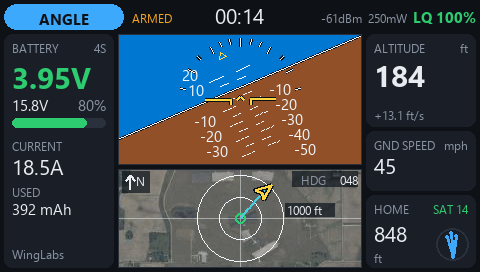
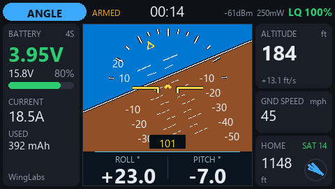
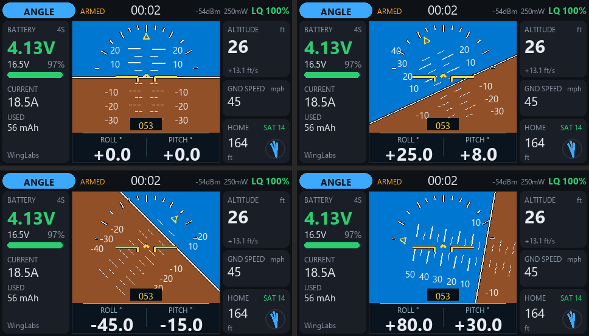
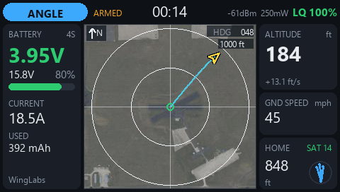
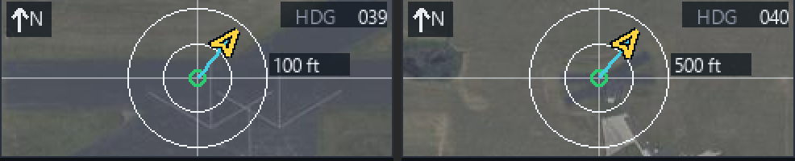
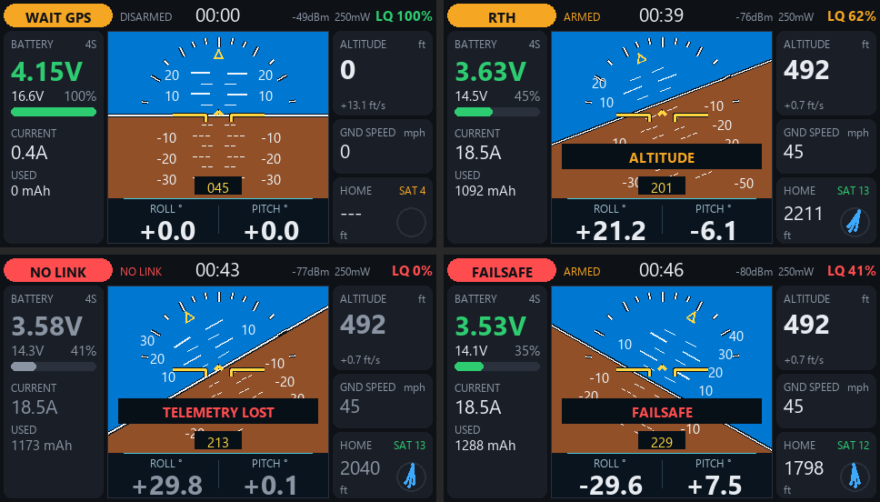
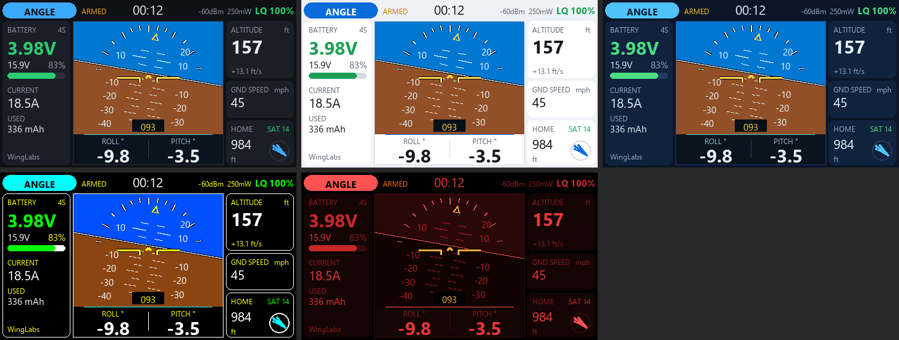
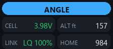
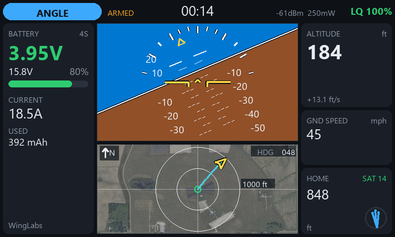

# WingLabs EdgeTX Widgets: INAV telemetry, attitude indicator and moving map for color radios

*WingLabs · October 2026*

**Download:** [github.com/rjmoragaramirez/winglabs-edgetx-widgets](https://github.com/rjmoragaramirez/winglabs-edgetx-widgets) (free and open source, MIT license)



When you fly an INAV aircraft over ELRS, your radio already receives everything that matters:
battery, link quality, GPS position, altitude, speed, heading and attitude. The WingLabs EdgeTX
widgets turn that stream into a clean, readable cockpit on the radio screen: a full-screen
dashboard with an attitude indicator, a moving map with a satellite photo of your flying field,
and alerts that tell you what you need to know without nagging you.

There are three widgets. They share the same telemetry engine, alerts and themes and differ in
what sits in the center of the screen:

| Widget | Center of the screen | Best for |
|---|---|---|
| **WL Attitude Ind** | Large attitude indicator with ROLL/PITCH readout | Line-of-sight flying, aerobatics, checking the attitude at a glance |
| **WL Avionics** | Attitude indicator on top, moving map below | General flying: everything on one screen |
| **WL Maps** | Full-height moving map | FPV and longer flights, orientation and finding the model |

Each one comes in two builds: **TX16S MK2** (480×272) and **TX16S MK3** (800×480).

---

## 1. What is on the screen



All three widgets share the same frame around the center area:

- **Top bar**
  - **Flight mode pill**, colored by severity: ANGLE, HORIZON, ACRO, MANUAL, ALT HOLD, POS HOLD,
    CRUISE, COURSE HOLD, LOITER, WAYPOINT, RTH, LANDING, TURTLE, FAILSAFE, WAIT GPS, NOT READY and so on.
  - **State**: ARMED, DISARMED or NO LINK.
  - **Flight timer**: runs while armed and keeps running if the link drops.
  - **RSSI and TX power**, plus **link quality** (LQ), colored green, amber or red.
- **Battery card**: cell voltage in large digits, pack voltage, cell count (auto-detected or
  fixed), percentage with a bar, current and consumed mAh.
- **Altitude card**: altitude and vertical speed.
- **Ground speed card**.
- **Home card**: distance to home, GPS satellites (green once there is a fix with 6 or more satellites) and an arrow that points
  home relative to the aircraft's heading.

Units are **imperial** (ft, mph, mi) by default, or metric.

When the link is lost, the last values stay on screen, dimmed. You keep the last known position,
distance and altitude, which is exactly what you need to walk to the model.

### The attitude indicator



The attitude indicator has the same look as the WingLabs attitude indicator firmware:

- sky and earth with a white horizon line outlined in dark;
- a pitch ladder every 5°, with solid marks above the horizon, dashed marks below and numbers every 10°;
- a bank scale with ticks at 10, 20, 30, 45, 60 and 80°, and a gold roll pointer;
- gold reference wings with downturned tips and a center chevron;
- a heading box, and in WL Attitude Ind a ROLL/PITCH strip with large digits.

Everything is drawn with vector lines, so it stays smooth and light on the radio's processor.

### The moving map



The map is **home-centered and north-up**:

- **Home** is the green circle in the middle. It is set automatically when you arm with a GPS fix.
- **The aircraft** is a gold arrow pointing in the direction of travel, with a thin line back to home.
- **The trail** of the flight is drawn in cyan. It is cleared when you arm again.
- **Range rings** show the scale (100 ft, 200 ft, 500 ft, 1000 ft … 20 mi, or 50 m … 50 km). The map
  **zooms automatically** so the whole flight always fits. It zooms out immediately and zooms back
  in only when there is room to spare, so the scale does not flicker.
- **HDG** shows the current heading. Before arming, the map shows "HOME SET ON ARM".

### Satellite photo of your flying field



Under the map you can show an aerial photo of your field (USA only):

- The imagery is **USGS NAIP**: US public domain, about 60 cm per pixel.
- A small PC tool downloads it once and cuts it into tiles at **exactly the screen resolution of
  every map zoom step**, so the radio never has to scale an image.
- On the radio, at most four tiles are on screen at a time. EdgeTX keeps up to eight decoded images
  in memory, so each tile is read from the SD card once and the next one is loaded only when the
  model crosses into it.
- Over the photo the rings turn white and the labels get a dark plate so they stay readable.
- Outside the photo area, with metric units or with the photo switched off, you simply get the
  vector map.

### Alerts that do not nag



One banner shows the most important alert at any moment, in this priority order:

| Alert | When | Sound and haptic |
|---|---|---|
| TELEMETRY LOST | The link drops after it was established | Low tone + 3 short pulses |
| FAILSAFE | INAV reports failsafe | High tone + 3 short pulses |
| BATTERY CRITICAL | Cell voltage at or below *CellCrit* | Cell voltage spoken + 3 short pulses |
| BATTERY LOW | Cell voltage at or below *CellWarn* | Cell voltage spoken |
| ALTITUDE | Armed and above *AltWarn* | Altitude spoken |
| WEAK LINK | Link quality below 50 % | Short tone |
| NO GPS FIX | Armed without a GPS fix | Banner only |

- **Every repeating alert sounds at most three times** per episode, then goes quiet; the banner
  stays. It re-arms as soon as the condition clears. Switch the model off after landing and you get
  three "telemetry lost" alerts, not an endless loop.
- **Haptic feedback is short pulses**, about 80 ms each: two when arming, one when disarming,
  three for an alert.
- Arming and disarming have their own tones, a flight-mode change while armed gives a short chirp,
  and the return of the link a short high tone.

### Themes



There are five themes:

- **Dark**: the default.
- **Light**.
- **Navy**.
- **Sunlight**: black and white with saturated colors, for direct sun.
- **Night**: red only, to preserve night vision.

Dark, Light and Navy use the same sky and earth colors as the WingLabs attitude indicator.

In a small screen zone the widget switches to a compact layout with flight mode, cell voltage,
altitude, link quality and home distance:



---

## 2. Requirements

| | TX16S MK2 build | TX16S MK3 build |
|---|---|---|
| Screen | 480×272 | 800×480 |
| Firmware | **EdgeTX 2.11 or later** (2.11.2+ recommended) | **EdgeTX 2.12 or later** (first release supporting the MK3) |
| Project folder | `widgets_edgetx\480x272px\` | `widgets_edgetx\800x480px\` |

- **Link**: ExpressLRS (CRSF telemetry).
- **Flight controller**: INAV, sending CRSF telemetry: attitude, GPS, battery, flight mode and so on.
- **SD card**: a few hundred KB for the widgets. The optional photo map needs about 25 MB on the MK2
  and about 70 MB on the MK3 per field (5-mile radius).

The widget reads these sensors, which INAV creates over CRSF: RQly, 1RSS, TPWR, RxBt, Curr, Capa,
Bat%, FM, GPS, GSpd, Hdg, Alt, Sats, Ptch, Roll, Yaw and VSpd.

---

## 3. Installing on the radio

### Step 1: copy the widgets to the SD card

Connect the radio to the PC in USB storage mode, or take the SD card out, and copy the widget
folders into `/WIDGETS/` on the card. Use the build for your radio:

| Widget | Copy this folder (from `480x272px\` or `800x480px\`) | To the SD card |
|---|---|---|
| WL Attitude Ind | `WLAttitudeInd\WIDGETS\WLAttitudeInd` | `/WIDGETS/WLAttitudeInd/` |
| WL Avionics | `WLAvionics\WIDGETS\WLAvionics` | `/WIDGETS/WLAvionics/` |
| WL Maps | `WLMaps\WIDGETS\WLMaps` | `/WIDGETS/WLMaps/` |

You can install one, two or all three. Do not rename the folders to anything longer: EdgeTX
silently ignores widget folders with names over 13 characters.

### Step 2: discover the telemetry sensors

With the model powered and the link up, open *Model → Telemetry* and run **Discover new sensors**.
Wait until the list stops growing (GPS and attitude sensors appear too), then stop discovery.
If a sensor is missing later, the widget looks for it again every 2 seconds, so you do not need
to restart anything.

### Step 3: create a full-screen page

1. Open *Model → Screens* (*Screens setup*) and add a screen, or pick an existing one.
2. Choose the layout **Full screen** (one zone).
3. In the layout options, **turn off Top bar, Sliders, Trims and Flight mode**.
   This matters: with the top bar on, or with the "App mode" layout, EdgeTX draws its own menu
   button (the EdgeTX logo) over the top-left corner of the widget. You still reach the menus with
   the SYS and MDL keys.
4. Tap the zone and select **WL Attitude Ind**, **WL Avionics** or **WL Maps**.

Repeat with more screens if you want more than one widget; swipe between them in flight.

### Step 4: set the widget options

Open *Screens setup*, select the widget's zone and choose *Widget settings*:

| Option | Values | Default | Notes |
|---|---|---|---|
| Theme | Dark, Light, Navy, Sunlight, Night | Dark | |
| Units | Imperial, Metric | Imperial | The photo map works in imperial |
| Cells | 0 = auto, 1–14 | 0 | Auto-detects the cell count when disarmed |
| CellWarn | 300–420 | 350 | Centivolts per cell: 350 = 3.50 V (BATTERY LOW) |
| CellCrit | 280–400 | 330 | 330 = 3.30 V (BATTERY CRITICAL) |
| AltWarn | 0–5000 | 400 | In ft or m; 0 = off |
| Sounds | on/off | on | Tones and voice |
| Haptic | on/off | on | Vibration pulses |
| MapPhoto | on/off | on | WL Avionics and WL Maps only |

How strongly the radio vibrates also depends on *Radio Setup → Haptic* (length and strength).

### Step 5 (optional): the satellite photo map

Photo tiles are made on a PC for the fields you fly at (anywhere in the USA). You need Python 3
with the Pillow package. From the `WLAvionics` folder of your build (`480x272px\WLAvionics` for the
MK2, `800x480px\WLAvionics` for the MK3), run, with your field's coordinates:

```
python tools/maptiles/make_field.py --name ama --lat 40.1666 --lon -85.3195 --radius-mi 5
```

(The example is the AMA International Aeromodeling Center in Muncie, Indiana.)

- The name can be up to 8 letters or digits.
- It makes the tile sets for both map widgets of that screen size and downloads only what is
  missing, so it can be stopped and restarted.
- Run it once per field.
- A 5-mile radius takes about 25 MB on the MK2 and about 70 MB on the MK3.

Then copy `tools\maptiles\out\WLMAP` to the **root** of the SD card, so it ends up as `/WLMAP/`.
WL Avionics and WL Maps share this folder.

On the radio, the widget picks the field automatically: when you arm, it uses the nearest field
whose photo area contains home.

---

## 4. In flight

1. **Power up and wait for GPS.** The pill shows WAIT GPS and the home card shows the satellite count.
2. **Arm.** You hear the arm tone and feel two pulses; the timer starts and home is set with the
   current GPS position.
3. **Fly.** The map zooms out as you go farther, the trail draws your path and the home arrow and
   distance guide you back.
4. **Alerts** appear as a banner, with voice and pulses for the important ones, at most three
   times each.
5. **Land and disarm.** One pulse and the disarm tone. Switch the model off: three "telemetry lost"
   alerts and then silence. The last position stays on screen.

---

## 5. Troubleshooting

| Symptom | Fix |
|---|---|
| The EdgeTX logo covers the top-left corner | Use the *Full screen* layout with Top bar off, not *App mode* (see step 3). |
| The widget is not in the list | Check the folder is `/WIDGETS/<name>/main.lua` and that the name is not longer than 13 characters. |
| "--" everywhere, NO LINK | No telemetry: check the ELRS link and run *Discover new sensors* again. |
| No attitude or map | INAV is not sending attitude/GPS over CRSF, or the sensors were not discovered. |
| Horizon moves the wrong way | Pitch/roll signs can be flipped in `telem.lua` (`PITCH_SIGN`, `ROLL_SIGN`). |
| No satellite photo | `/WLMAP/` missing or in the wrong place (it must be at the SD root), MapPhoto off, metric units, home outside the photo area, or tiles made for the other radio model. |
| The MK3 widgets do not appear | The MK3 build needs EdgeTX 2.12 or later. |

---

## 6. Under the hood

The widgets are written in Lua for EdgeTX's LVGL user interface and are built to stay responsive
for a whole flight:

- Plain `.lua` files: EdgeTX compiles and caches them itself.
- Every module is loaded once at start-up; nothing is read from the SD card during normal flight
  (photo tiles excepted, and only when crossing into a new tile).
- No manual garbage collection and almost no garbage per frame (under 1 KB).
- Telemetry is polled at a fixed rate and screen text is formatted only when a value changes.
- The attitude indicator and map use vector lines only, with preallocated tables.
- Colors come from semantic theme tokens, so new themes are easy to add.
- No global variables, and the model's timers are never touched.

Every build has a **desktop simulator**: `tools/sim/run_sim.py`, which needs Python with lupa and
Pillow. It runs the real widget code against a strict model of the EdgeTX API and flies a
synthetic mission: no link, waiting for GPS, armed, RTH, link lost, failsafe and battery critical.
It checks:

- the processor budget per frame (EdgeTX allows 20,000 instructions per call; the widgets use
  well under half);
- memory allocation per frame;
- how often photo tiles are loaded;
- that the aircraft arrow keeps its shape;
- the "model switched off" alert sequence.

It also renders screenshots like the ones in this article.



*WL Avionics on the TX16S MK3 (800×480).*

---

## 7. Project status

| Widget | Version | Status |
|---|---|---|
| WL Attitude Ind | 0.2.0 | Version 0.1 flown on a TX16S MK2; 0.2 validated in the simulator |
| WL Avionics | 0.2.1 | Validated in the simulator |
| WL Maps | 0.1.0 | Validated in the simulator |
| MK3 builds | same versions | Validated in the simulator at 800×480; waiting for hardware |

Still to confirm on the radio: the exact font sizes, how the vibration pulses feel, tile loading
time when crossing photo tiles, and that the aircraft position over the photo matches the ground.

Ideas for next versions: custom voice files for flight modes, a flight statistics page with
maximum altitude, speed and distance, and log playback.

---

## Repository layout

```
480x272px/              TX16S MK2 builds (EdgeTX 2.11+)
  WLAttitudeInd/        WIDGETS/WLAttitudeInd  + tools/sim
  WLAvionics/           WIDGETS/WLAvionics     + tools/sim + tools/maptiles (photo tile generator)
  WLMaps/               WIDGETS/WLMaps         + tools/sim
800x480px/              TX16S MK3 builds (EdgeTX 2.12+), same structure
article_images/         images used in this document
```

Each project folder has its own README with the details of that widget.

## License

MIT, see [LICENSE](LICENSE). Satellite imagery used by the photo map is USGS NAIP (US public
domain); it is downloaded by the tile generator and not included in this repository.
